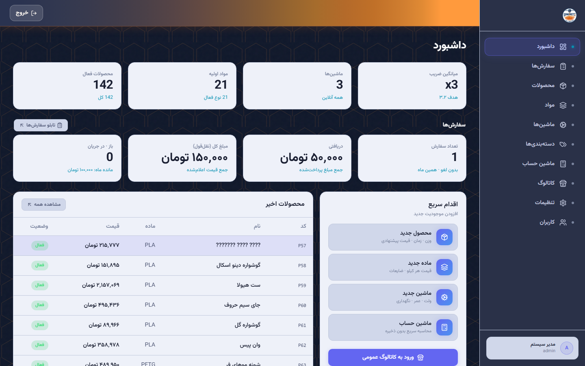
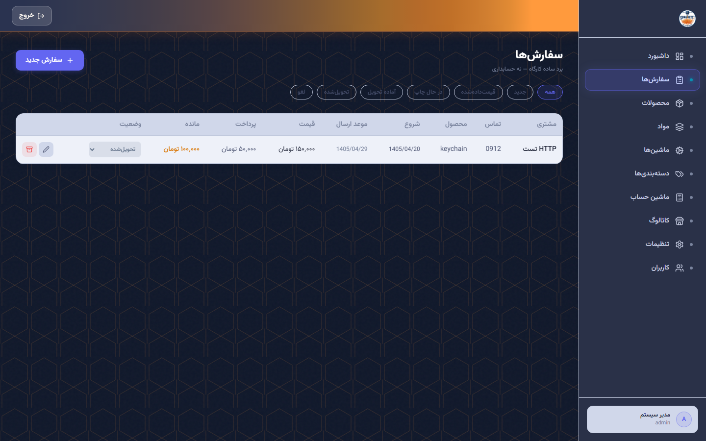
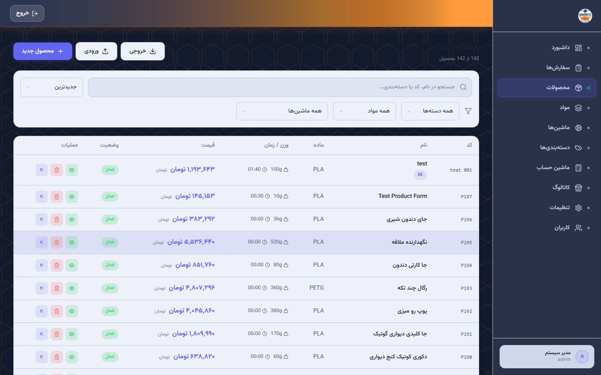
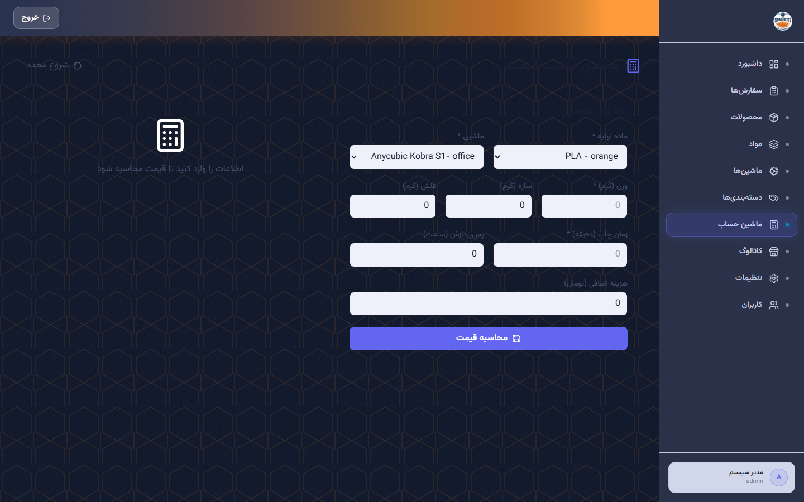
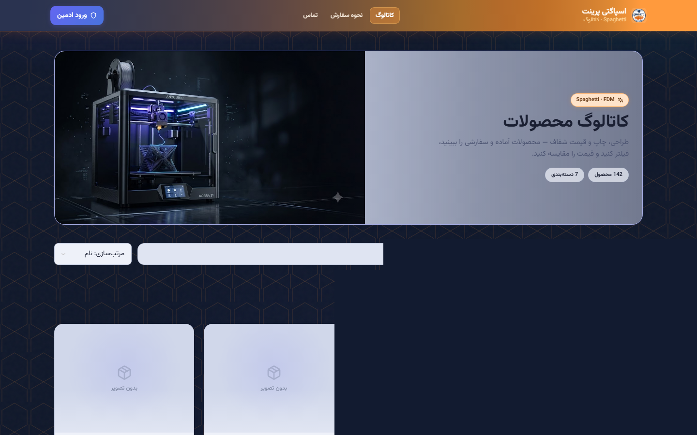

# Spaghetti — 3D Printing Product Pricing System

<div align="center">

**سیستم مدیریت محصولات و قیمت‌گذاری چاپ سه‌بعدی**

[](https://python.org)
[](https://fastapi.tiangolo.com)
[](https://reactjs.org)
[](https://sqlite.org)
[](LICENSE)

**Repos**
- GitHub: [ba4b0d/DDD-Job](https://github.com/ba4b0d/DDD-Job) · [ba4b0d/3djat-pricing](https://github.com/ba4b0d/3djat-pricing)
- Gitea: `http://192.168.100.33:3000/ba4b0d/DDD-Job`

</div>

---

## Overview

Spaghetti is a full-stack web app for **FDM 3D-print** product catalog, cost calculation, inventory, and a lightweight workshop **orders board**. Admin manages products/materials/machines; customers browse a public Farsi catalog.

**Key Features:**
- 🔐 Role-based auth (Admin / Employee) — bcrypt + JWT
- 📊 Real-time cost engine (material, power, downtime, overhead, markup)
- 🛒 **Orders board (B)** — fixed statuses, start/ready Shamsi dates, paid/quoted amounts
- 📈 Dashboard KPIs — inventory strip + **monthly order ops** (count, paid, quoted, open)
- 🖼️ Multi-image products (up to 5) + public catalog
- 📦 Materials & machines · 🏷️ categories
- 📥 Excel/CSV import & export
- 🇮🇷 Persian/Farsi **RTL** (Vazirmatn) · soft-blue + logo orange branding
- 📱 Mobile-responsive admin + catalog

---

## Screenshots

| Dashboard | Orders | Products |
|:---:|:---:|:---:|
|  |  |  |
| *KPIs + monthly سفارش‌ها* | *Board + Shamsi dates* | *Catalog management* |

| Calculator | Public catalog |
|:---:|:---:|
|  |  |
| *Live cost breakdown* | *Farsi public storefront* |

---

## Tech Stack

### Backend
| Component | Technology |
|-----------|------------|
| Framework | FastAPI 0.104+ |
| Database | SQLite (SQLAlchemy ORM) |
| Auth | bcrypt + JWT (PyJWT) |
| Validation | Pydantic v2 |
| Rate limiting | slowapi |
| Dates | Gregorian ISO in API · Shamsi in UI |

### Frontend
| Component | Technology |
|-----------|------------|
| Framework | React 18 |
| Bundler | Vite 5 |
| Styling | TailwindCSS |
| Routing | React Router v6 |
| HTTP | Axios |
| Icons | Lucide React |
| Calendar | `jalaali-js` + `react-multi-date-picker` |

---

## Project Structure

```
3djat-pricing/
├── backend/
│   ├── app/
│   │   ├── main.py              # FastAPI, CORS, startup
│   │   ├── models.py            # Settings, Machine, Material, Product, Order, …
│   │   ├── schemas.py           # Pydantic models
│   │   ├── calculator.py        # Cost engine
│   │   ├── cache.py             # Settings/stats cache
│   │   ├── seed.py              # First-run seed
│   │   ├── database.py
│   │   └── routers/
│   │       ├── auth.py
│   │       ├── products.py      # CRUD + images + calculate + import/export
│   │       ├── catalog.py       # Public catalog
│   │       ├── orders.py        # Workshop board + invalidate stats
│   │       ├── materials.py · machines.py · categories.py
│   │       ├── settings.py
│   │       └── stats.py         # Dashboard + monthly order KPIs
│   ├── tests/
│   ├── uploads/
│   ├── requirements.txt
│   └── Dockerfile
├── frontend/
│   ├── src/
│   │   ├── pages/               # Dashboard, Orders, Products, Catalog, …
│   │   ├── components/          # Layout, ShamsiDateField, CostBreakdown, …
│   │   └── lib/                 # api, auth, shamsi, utils, theme
│   ├── package.json
│   └── Dockerfile
├── screenshots/                 # README captures
├── scripts/                     # Gitea release build/publish/deploy
├── docker-compose.yml
└── README.md
```

---

## Quick Start

### Prerequisites
- Python 3.11+
- Node.js 18+
- npm

### Backend

```bash
cd backend
python -m venv .venv
# Windows: .venv\Scripts\activate
# Linux/Mac: source .venv/bin/activate
pip install -r requirements.txt
echo "JWT_SECRET=your-super-secret-key-here" > .env
uvicorn app.main:app --reload --host 127.0.0.1 --port 8000
```

### Frontend

```bash
cd frontend
npm install
npm run dev
```

Vite proxies `/api` and `/uploads` → `http://localhost:8000` by default.  
Override with `VITE_API_URL` if the API runs elsewhere (e.g. `:8001`).

### Access

| Page | URL | Auth |
|------|-----|------|
| Public catalog | http://localhost:5173/ | ❌ |
| Login | http://localhost:5173/login | ❌ |
| Dashboard | http://localhost:5173/dashboard | ✅ |
| Orders | http://localhost:5173/orders | ✅ |
| API docs | http://localhost:8000/docs | ❌ |

**Default credentials:** `admin` / `admin`  
> ⚠️ Forced password change on first login.

---

## Docker

```bash
docker-compose up -d
docker-compose logs -f
docker-compose down
```

Release-oriented scripts live under `scripts/` (Gitea build / publish / deploy).

---

## Orders board & dashboard KPIs

Minimal workshop board (**not** full accounting):

| Status | Meaning |
|--------|---------|
| `new` | New |
| `quoted` | Price given |
| `printing` | In print |
| `ready` | Ready for delivery |
| `delivered` | Delivered |
| `cancelled` | Cancelled |

- **Dates:** `started_at` / `ready_by` — ISO Gregorian in API, **Shamsi** in UI (Jalali picker).
- **Money:** `quoted_price`, `paid_amount` (تومان). Soft-archive via `is_active=false`.

**Monthly dashboard strip** (`GET /api/v1/stats`, calendar month UTC):

| Field | Description |
|-------|-------------|
| `orders_this_month` | Active non-cancelled, `created_at` this month |
| `orders_paid_this_month` | Σ `paid_amount` |
| `orders_quoted_this_month` | Σ `quoted_price` |
| open / in-progress counts | Pipeline hints (`new`→`ready`) |

Stats cache is invalidated on order create/update/archive.

---

## Cost formula

```
material_cost = (weight + support + flushed) × (1 + waste%) × price_per_kg ÷ 1000
power_cost = (watts ÷ 1000) × print_hours × electricity_rate
downtime_cost = print_hours × (purchase_price ÷ life_hours)
maintenance_cost = downtime_cost × maintenance_pct
coloring_cost = post_pro_hours × coloring_cost_per_hour
overhead = (sum_above) × overhead_ratio  [default 30%]
base_price = sum_above + overhead + extras_cost
suggested_price = base_price × markup  [default 3x]
```

---

## API (summary)

Base path: `/api/v1/`

| Area | Notes |
|------|--------|
| Auth | `POST /auth/login`, verify, refresh |
| Catalog | Public product + category lists |
| Products | CRUD, images, calculate, import/export |
| Orders | Board CRUD + soft archive |
| Materials / Machines / Categories | CRUD |
| Settings | Bulk update |
| Stats | Dashboard aggregates + monthly order KPIs |

Interactive docs: `/docs` when the backend is running.

---

## Testing

```bash
# Backend
cd backend && pytest tests/ -v

# Frontend
cd frontend && npm test
```

---

## Environment

| Variable | Required | Default | Description |
|----------|----------|---------|-------------|
| `JWT_SECRET` | Yes | — | JWT signing key |
| `ADMIN_USER` | No | `admin` | Seed admin user |
| `ADMIN_PASS` | No | `admin` | Seed password (force-change) |
| `VITE_API_URL` | No | `http://localhost:8000` | Dev proxy target |

---

## Security

- bcrypt passwords · JWT (24h) · login rate limit  
- CORS allow-list · Pydantic validation · upload size caps  
- RBAC on admin routes · SQLAlchemy (no raw SQL) · soft deletes

---

## Contributing

1. Fork / clone  
2. Branch: `git checkout -b feature/…`  
3. Commit & push  
4. Open a PR on GitHub or Gitea  

Mirror remotes typically used:

```bash
git remote add origin https://github.com/ba4b0d/DDD-Job.git   # or 3djat-pricing
git remote add gitea  http://192.168.100.33:3000/ba4b0d/DDD-Job.git
git push origin master && git push gitea master
```

---

## License

MIT — see [LICENSE](LICENSE).

---

<div align="center">

**Built with ❤️ for 3D printing businesses · FDM · تومان · RTL**

</div>
