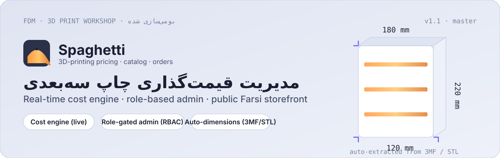
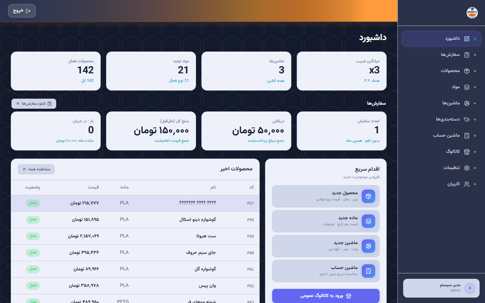
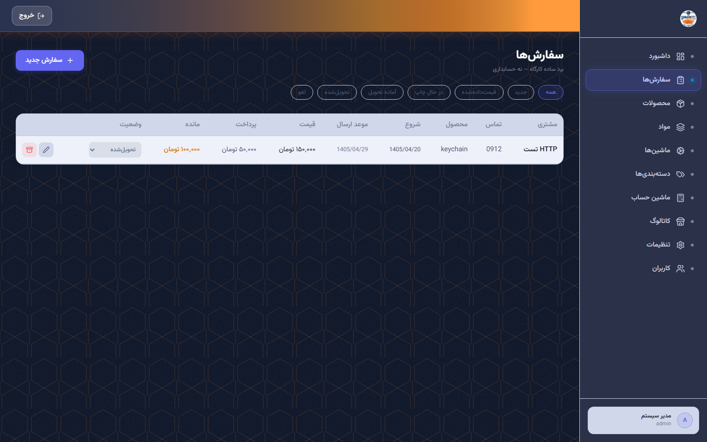
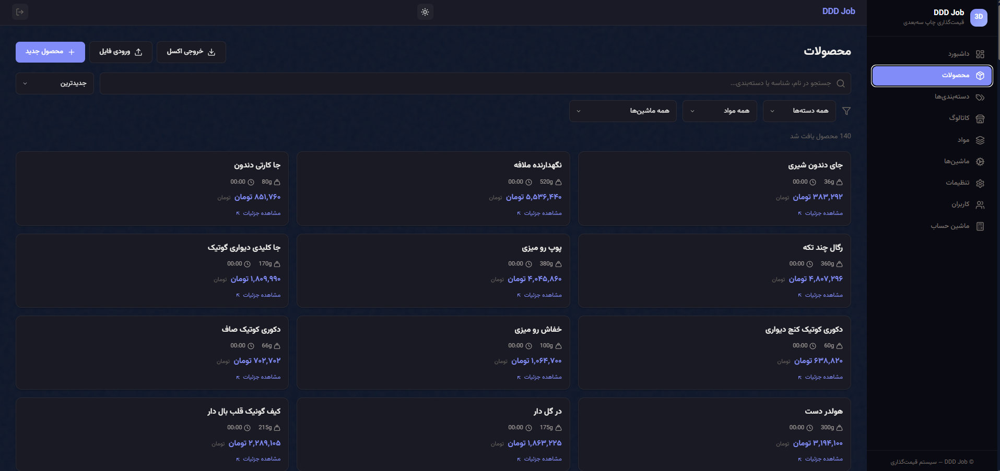
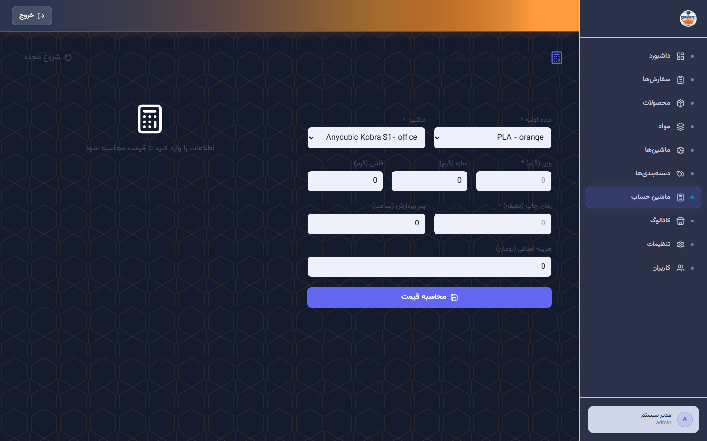
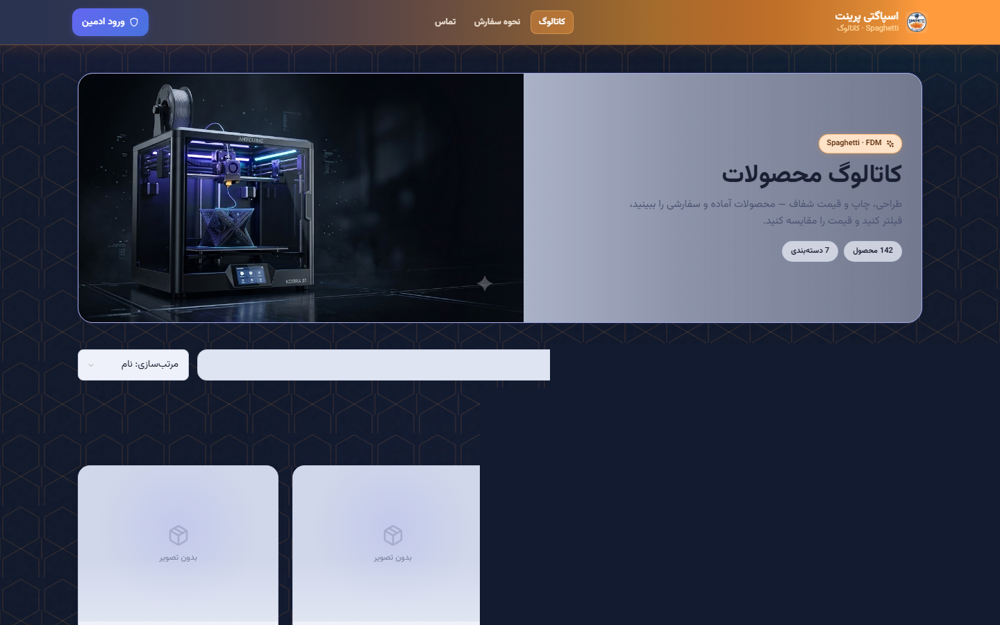
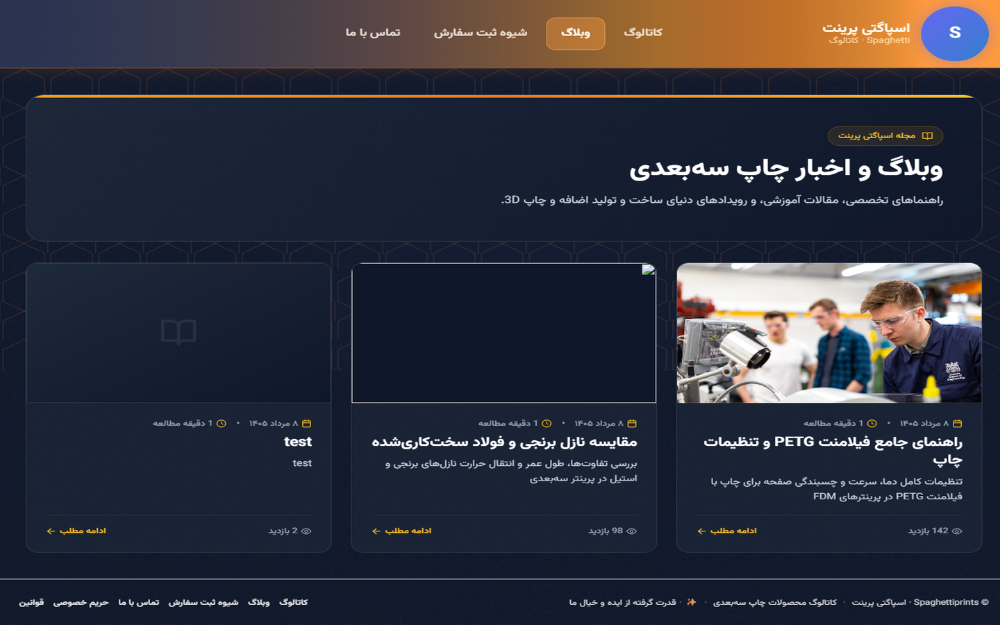

<p align="center">
  
</p>

<div align="center">

**سیستم جامع مدیریت محصولات، قیمت‌گذاری و سفارشات چاپ سه‌بعدی اسپاگتی**

[](https://python.org)
[](https://fastapi.tiangolo.com)
[](https://reactjs.org)
[](https://sqlite.org)
[](LICENSE)

</div>

---

## 🌟 Overview

**Spaghetti** is a modern, production-ready full-stack web application designed for 3D printing workshops (**FDM**). It combines an automated product pricing engine, public storefront catalog with mega-menu navigation, lightweight blog/CMS with SEO metadata, a Telegram order bot, and a real-time shop order tracking board.

---

## ✨ Key Features & Capabilities

- 🧮 **Real-time Cost Engine** — Material weight, support, flushed volume, power consumption, machine depreciation, maintenance, post-processing, overhead, and custom markup in a single formula.
- ⭐ **Default Printer & Filament** — Mark primary machines and filaments to auto-populate forms when creating new products.
- 📂 **Sub-categories & Mega-menu** — Hierarchical category tree with two-panel mega-menu dropdown on desktop and expandable accordion in mobile hamburger menu.
- 🛍️ **Public Catalog Storefront** — Hero section with CTA, product grid with images/prices/dimensions (cm), Telegram share buttons, category filtering via URL params.
- 🎨 **Custom Order Page** — Dedicated "سفارش طرح دلخواه" page with step-by-step flow for custom 3D print requests.
- 📝 **Blog & CMS Module** — Built-in article manager with cover image upload, Persian reading time, Telegram sharing, and structured `Article` JSON-LD schema for SEO. Dynamic on/off toggle via Settings.
- 🛒 **Workshop Orders Board** — Manage shop orders with Shamsi (Jalali) calendar support, payment statuses, and quick action steps.
- 📏 **Auto 3D Mesh Extraction** — Automatically computes X/Y/Z dimensions directly from uploaded 3MF or STL files.
- 💾 **WAL-Safe Database Backup & Restore** — One-click database export (`.db`), instant backup upload & restore in UI, plus an automated daily 14-day rolling backup script for production.
- 🤖 **Telegram Order Bot** — Lightweight polling bot with SOCKS5 proxy, inline keyboards, multi-item order wizard with dynamic pricing, and multi-admin support via comma-separated chat IDs.
- 🛡️ **Hardened Security** — `httpOnly` cookie JWT auth, `slowapi` rate limiting on all mutating endpoints, magic-byte validation for uploaded images, `COOKIE_SECURE` env var, `SENSITIVE_SETTING_KEYS` RBAC filtering, and Farsi slug generation.
- 📝 **Writer Role** — Blog-only access role for content creators; sidebar shows only "وبلاگ" for writers.
- 🇮🇷 **Native Persian / RTL UI** — Vazirmatn typography, responsive Tailwind layout, and soft-blue / brand-orange dark theme.

---

<p align="center">
  
</p>

| 📊 Dashboard & Analytics | 🛒 Orders Board (Kanban) | 📦 Inventory & Products |
|:---:|:---:|:---:|
|  |  |  |
| *KPIs + Monthly Analytics* | *Kanban Board + Shamsi Dates* | *Inventory Management* |

| 🧮 Cost Calculator Engine | 🛍️ Public Customer Storefront | 📝 Blog & CMS Module |
|:---:|:---:|:---:|
|  |  |  |
| *Live Pricing Breakdown* | *Farsi Customer Catalog* | *SEO Articles & CMS Management* |

---

## 🧮 Cost Calculation Engine

$$\text{Material Cost} = (\text{weight} + \text{support} + \text{flushed}) \times (1 + \text{waste\%}) \times \frac{\text{price\_per\_kg}}{1000}$$

$$\text{Power Cost} = \frac{\text{watts}}{1000} \times \text{print\_hours} \times \text{electricity\_rate}$$

$$\text{Depreciation Cost} = \text{print\_hours} \times \frac{\text{purchase\_price}}{\text{life\_hours}}$$

$$\text{Base Price} = \text{Material} + \text{Power} + \text{Depreciation} + \text{Maintenance} + \text{Coloring} + \text{Overhead (30\%)}$$

$$\text{Suggested Price} = \text{Base Price} \times \text{Markup (e.g. 3.0}\times\text{)}$$

---

## 🚀 Quick Start

### Prerequisites
- **Python** 3.11+
- **Node.js** 18+ & **npm**

### 1. Backend Setup
```bash
cd backend
python -m venv .venv
source .venv/bin/activate    # Windows: .venv\Scripts\activate
pip install -r requirements.txt
cp .env.example .env         # Edit with your JWT_SECRET and other vars
uvicorn app.main:app --reload --host 127.0.0.1 --port 8000
```

### 2. Frontend Setup
```bash
cd frontend
npm install
npm run dev
```

### 3. Production Docker Deployment
```bash
docker compose up -d --build
docker compose logs -f
```

---

## ⚙️ Environment Variables

Copy `.env.example` to `.env` and configure:

| Variable | Description | Default |
|:---|:---|:---|
| `JWT_SECRET` | Secret key for JWT signing (≥32 chars) | *required* |
| `COOKIE_SECURE` | Set `true` for HTTPS production | `false` |
| `LOG_LEVEL` | Logging level (`DEBUG`, `INFO`, `WARNING`) | `INFO` |
| `TELEGRAM_BOT_TOKEN` | Telegram bot API token | *optional* |
| `TELEGRAM_ADMIN_CHAT_ID` | Comma-separated admin chat IDs | *optional* |
| `TELEGRAM_PROXY` | SOCKS5 proxy URL for Telegram API | *optional* |

---

## 📍 Navigation & Access

| Page / Endpoint | Path | Auth Required |
|:---|:---|:---:|
| Public Storefront Catalog | `http://localhost:5173/` | ❌ |
| Category Page (no hero) | `http://localhost:5173/category/:id` | ❌ |
| Public Blog Articles | `http://localhost:5173/blog` | ❌ (if enabled) |
| How to Order | `http://localhost:5173/how-to-order` | ❌ |
| Custom Order | `http://localhost:5173/custom-order` | ❌ |
| Contact | `http://localhost:5173/contact` | ❌ |
| Admin Login | `http://localhost:5173/login` | ❌ |
| Dashboard | `http://localhost:5173/dashboard` | ✅ |
| Workshop Orders Board | `http://localhost:5173/orders` | ✅ |
| Admin CMS Posts | `http://localhost:5173/admin/posts` | ✅ (admin/writer) |
| System Settings | `http://localhost:5173/settings` | ✅ (admin) |
| Interactive API Docs | `http://localhost:8000/docs` | ❌ |

**Default Admin Credentials**: `admin` / `admin123`

---

## 🛡️ Security & Backup Architecture

- **Auth Storage**: JWT issued via `httpOnly`, `SameSite=Lax` cookies — immune to XSS token theft.
- **Rate Limiting**: `slowapi` on all mutating endpoints — login (5/min), orders (20/min), settings (20/min), blog (10/min), backup (5/min).
- **Image Inspection**: Validates binary magic-byte signatures (`\x89PNG`, `\xff\xd8\xff`, `RIFF` WEBP) for all uploads including branding assets.
- **Sensitive Settings RBAC**: Credential fields (JWT_SECRET, passwords, Telegram tokens) hidden from non-admin roles.
- **Backup Integrity**: Upload size limit (10MB) and SQLite header validation on backup import.
- **Logging Framework**: Structured logging via `logging` module with configurable `LOG_LEVEL` env var.
- **Database Backup**:
  - **Manual UI**: Download `.db` backup file or restore from a previous backup in `/settings`.
  - **Automated Host Script**: Run `./scripts/backup-db.sh` via cron for daily WAL-safe backups with automatic 14-day rotation.

```cron
# Example daily 3:00 AM backup cron job
0 3 * * * /bin/bash /path/to/3djat-pricing/scripts/backup-db.sh >> /path/to/backup.log 2>&1
```

---

## 🛠️ Tech Stack

- **Backend**: Python 3.11, FastAPI 0.104+, SQLAlchemy 2.0 (SQLite WAL mode), Pydantic v2, PyJWT, slowapi, PySocks (SOCKS5 proxy).
- **Frontend**: React 18, Vite 5, TailwindCSS, React Router v6, Axios (`withCredentials`), Lucide Icons, `jalaali-js`.
- **Infrastructure**: Docker Compose (Non-root containers with HTTP healthchecks).
- **Telegram Bot**: Lightweight polling + `PySocks` + SOCKS5 proxy. Inline keyboards, multi-item order wizard.

---

## 📄 License

Distributed under the **MIT License**. See [`LICENSE`](LICENSE) for details.

<div align="center">

**Designed with ❤️ for 3D Printing Workshops & Businesses**

</div>
